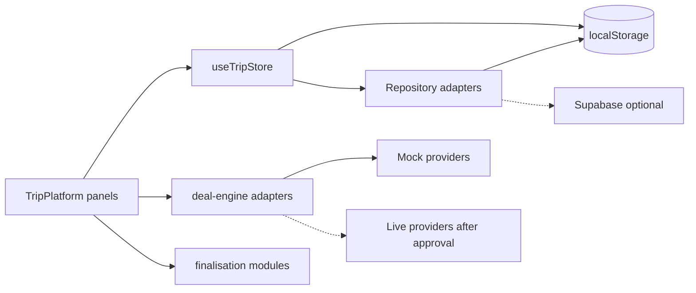
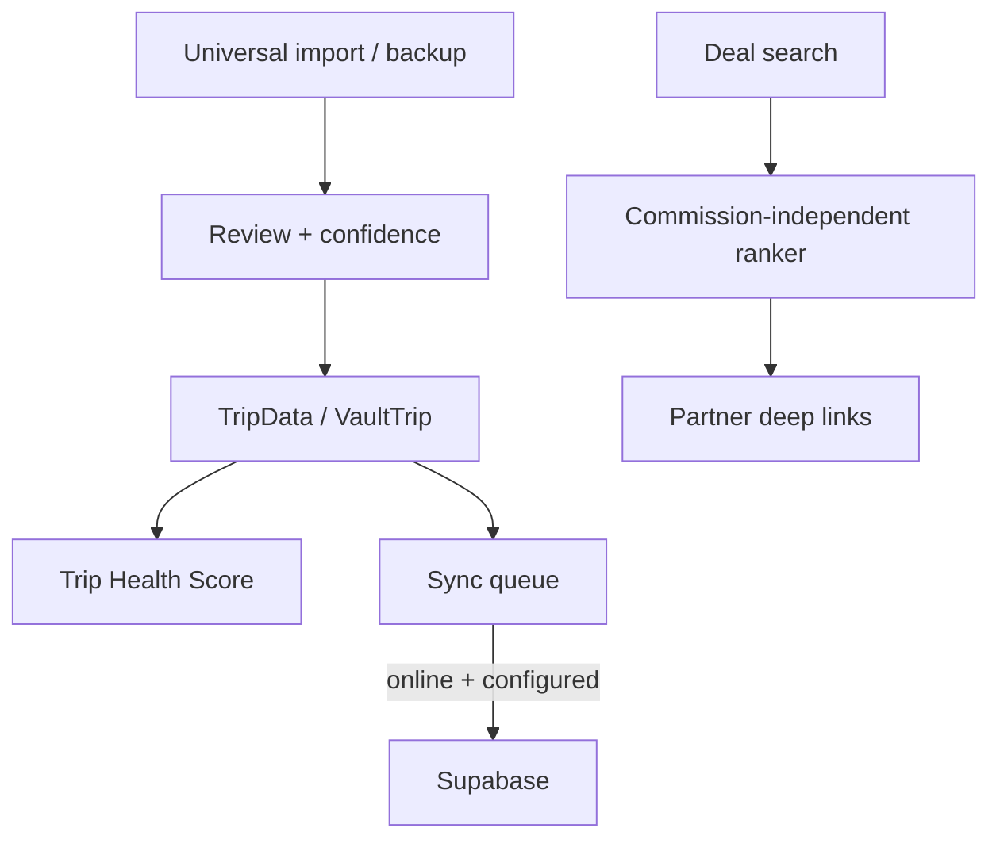

# Developer Platform Guide (Slice 97)

## Architecture overview



## Data flow



## Extension guide

1. Prefer new domain modules under `src/store/`, `src/deal-engine/`, or `src/finalisation/`.
2. Keep UI panels lazy-loaded from `TripPlatform`.
3. Persist user/platform state via dedicated storage keys in `storeConstants`.
4. Add Vitest coverage for domain logic; smoke-test large panels.

## Provider / adapter integration guide

See [`provider-adapter-specification.md`](provider-adapter-specification.md).

Rules:

- Implement `TravelProviderAdapter`
- Register live adapters only after credentials + approval
- Never scrape; never put secrets in frontend bundles

## Plugin / adapter guide

- Inventory adapters live in `src/deal-engine/adapters/`
- Import parsers live in `src/finalisation/importEngine.ts`
- Feature flags gate experimental surfaces via Release centre

## Testing guide

```bash
npm run typecheck
npm test
npm run test:coverage
npm run build
npm run validate
```

Add deterministic unit tests for ranking, import parsing, trip health, offline transitions, and security helpers. Use Testing Library for navigation smoke tests.

## Contribution guide

1. Branch from verified `main` using `cursor/<name>-03b5`.
2. Do not merge divergent PRs #1, #3, #6.
3. Do not deploy or auto-merge.
4. Preserve local/demo mode and optional cloud.
5. Document completed slices in `docs/completed-slices.md`.
6. Never fabricate partnerships, conversions, or commercial metrics.
